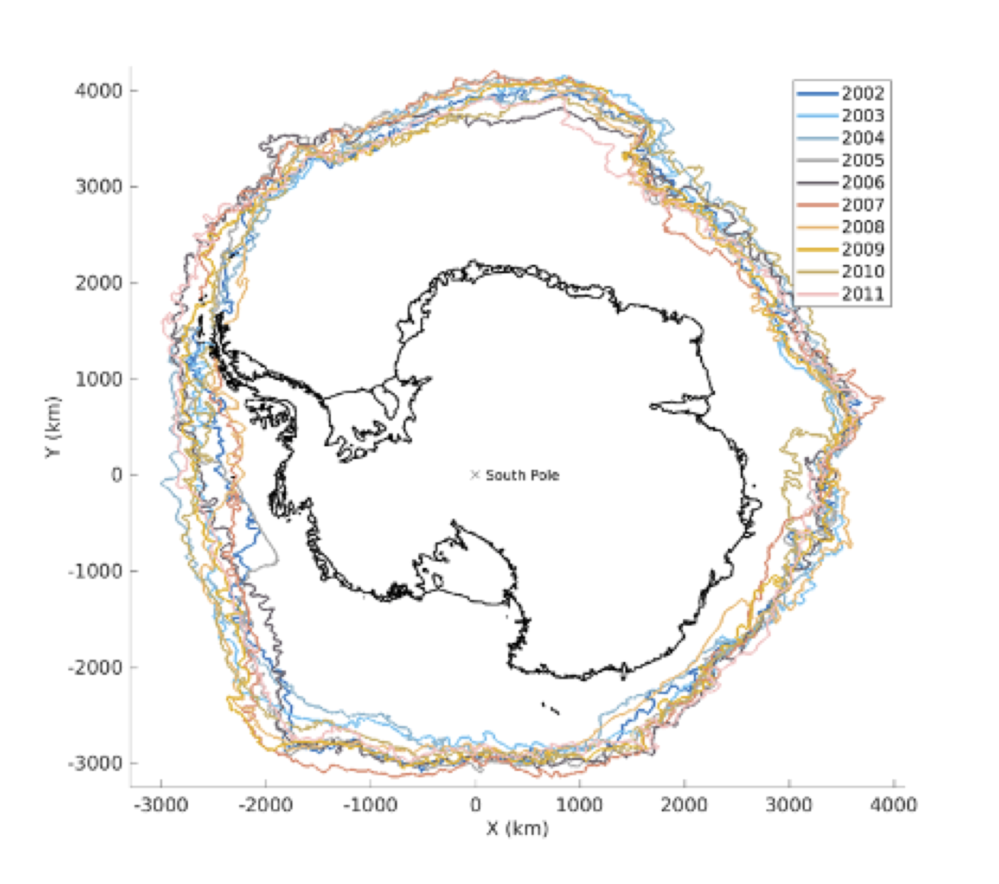

## Primary Ice Edge extraction tools

||
|:--:|
|Ice edge position on September 22-24 in the year indicated by line color.  AMSR-E data processed with the NT2 algorithm.|

### Purpose

This repository holds a collection of *Matlab* scripts developed to extract the outermost edge of the sea ice ("the primary ice edge") from satellite-observed sea ice concentration.  

### Methodology

Given a two-dimensional map of ice concentration, $C(x,y)$, we define the ice edge to be given by a low concentration value, typically $C_0=15\%$.  The question is how to invert the field to get $(X(C=C_0), Y(C=C_0))$, the spatial position of the corresponding edge.

We use the *Matlab* function *contour* to plot the ice concentrations. The function returns a two-dimensional array $(x,y)$ of positions of a given contour (e.g $C_0=15$). These position arrays consist of line segments separated by a distinctive marker.  We scan through this array and extract the segments.  The endpoints of the segments are examined, and, if they are within `max_gap` distance (see below) of each other, they are joined together.  This allows the 

### Input data

Scripts are provided for reading several passive microwave ice concentration products, including SSM/I, AMSR-E, and AMSR2.  However, you will need to download these files to your local machine.

First, acquire the sea ice concentration data sets

* AMSR2 at 3.125 km analyzed using the ARTIST algorithm: [`ftp-projects.cen.uni-hamburg.de/seaice/AMSR2/3.125km/`](). The files are compressed netcdf files with names like `Ant_20120801_res3.125km.pyres.nc.gz`.  After downloading, uncompress these files (e.g. using gzip on linux).
* AMSRE at 6.25 km for the years 2002-2011 analyzed using the ARTIST algorithm: [`ftp-projects.cen.uni-hamburg.de/seaice/AMSR-E_ASI_IceConc/hdf/s6250/`](). The files are compressed hdf files with names like `asi-s6250-20110204-v5i.hdf.gz`
* AMSRE at 12.5 km for the years 2002-2011 analyszed using the NASA Team 2 (NT2) algorithm.  Go to [`https://doi.org/10.5067/AMSR-E/AE_SI12.003`]() and select the "Download Data" tab.  To get a large number of files, choose the "Other Access Options" button.
* SSM/I at 25 km for the years 1978-2018 using the Bootstrap algorithm.  Go to [`https://doi.org/10.5067/7Q8HCCWS4I0R`]() and select the "Download Data" tab.  To get a large number of files, choose the "Other Access Options" button.

### Usage 

The master script is `run_iceedge_finder`, which calls all other scripts.  

Before running the script, set `data_dir_root` to point to the directory where the downloaded data sets reside.  They are assumed to be in subdirectories named `AMSR2`, `AMSEB`,`AMSRH`,`SSMI1`.

Choose the [data_type], which corresponds to the satellite data source.  There are two other parameters that can be chosen `smooth_scale` and `max_gap`.  `smooth_scale` is the smoothing scale in kilometers (larger is smoother) and `max_gap` is the largest gap (in kilometers) that is allowed in a segment before breaking it into two.  This allows the segment to continue across a small island or peninusla.

### Example Application

These scripts were used to extract the primary ice edge from all four data sets with `smooth_scale=500` and `max_gap=100`. 

The output files are stored at from the sample run are archived at [Zenodo](https://zenodo.org/record/3669406#.XkoALy2ZOuo)

### References

Cavalieri, D. J., T. Markus, and J. C. Comiso. 2014. AMSR-E/Aqua Daily L3 12.5 km Brightness Temperature, Sea Ice Concentration, & Snow Depth Polar Grids, Version 3. [Indicate subset used]. Boulder, Colorado USA. NASA National Snow and Ice Data Center Distributed Active Archive Center. doi:[`https://doi.org/10.5067/AMSR-E/AE_SI12.003`](). Accessed Jan. 7. 2020.

Comiso, J. C. 2017. Bootstrap Sea Ice Concentrations from Nimbus-7 SMMR and DMSP SSM/I-SSMIS, Version 3. [Indicate subset used]. Boulder, Colorado USA. NASA National Snow and Ice Data Center Distributed Active Archive Center. doi:[`https://doi.org/10.5067/7Q8HCCWS4I0R`]().  Accessed Jan. 7, 2020.

